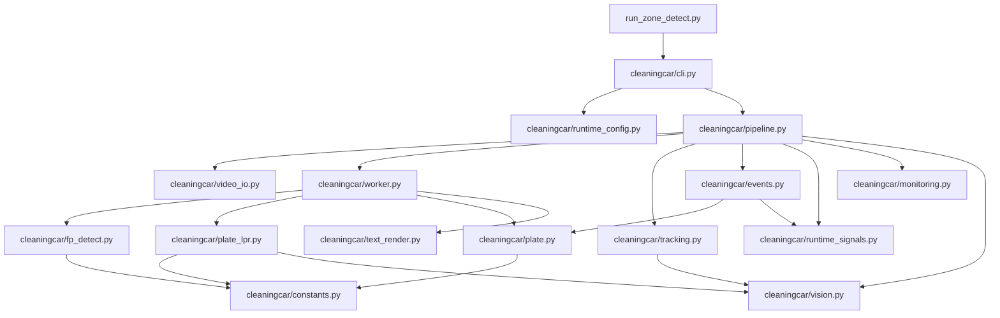

# cleaningcar 模块说明

`cleaningcar/` 是项目主运行包，负责把视频输入、RKNN 推理、车牌识别、跟踪、事件、截图、运行信号和守护配合起来。

## 模块职责

- `constants.py`
  - 定义类别列表、类别阈值、车牌字符表、颜色常量和业务映射
  - 现在项目内统一以这里的车牌字符定义为准

- `runtime_config.py`
  - 读取配置并生成运行时配置
  - 将 CLI 覆盖项与默认值合并

- `video_io.py`
  - 打开视频源
  - 管理 RTSP / 文件输入
  - 负责 FFmpeg H.264 输出和运行时路径解析

- `vision.py`
  - 提供 IoU、点位缩放、anchor 计算等几何工具

- `fp_detect.py`
  - 负责 FP 检测模型后处理
  - 支持 `6` 输出模式和 `9` 输出模式切换

- `plate_lpr.py`
  - 双模型车牌识别主链路
  - 包含车牌检测、透视矫正、字符解码、颜色解码

- `plate.py`
  - 车牌文本规范化
  - 合法性校验
  - 车牌锁定辅助
  - 这里只做文本后处理和锁定，不负责旧 `lpr.rknn` 单模型推理

- `text_render.py`
  - 统一中文文本渲染层
  - 优先使用 `fonts/platech.ttf`
  - 无项目字体时按固定系统字体顺序兜底

- `tracking.py`
  - 负责车辆目标跟踪

- `events.py`
  - 负责事件状态机、事件 JSON、事件截图和事件上报
  - 事件截图现已收口为“只有真实落盘成功才写入路径”

- `worker.py`
  - 每个 RKNN worker 线程负责：
    - 检测模型推理
    - 检测后处理
    - 双模型车牌识别
    - 车牌框与车牌文本叠字

- `runtime_signals.py`
  - 输出心跳文件、启动标志、启动截图、手动截图

- `monitoring.py`
  - 输出 CPU、内存、温度等运行监控信息

- `pipeline.py`
  - 主流程总调度层
  - 负责把读流、worker、跟踪、事件、截图、命令处理和单车视频串起来

- `cli.py`
  - 命令行入口
  - 把配置和参数组装后交给 `pipeline.py`

## 主调用关系

1. `run_zone_detect.py`
2. `cleaningcar/cli.py`
3. `cleaningcar/pipeline.py`
4. `cleaningcar/worker.py`
5. `cleaningcar/fp_detect.py` + `cleaningcar/plate_lpr.py`
6. `cleaningcar/tracking.py` + `cleaningcar/events.py`
7. `cleaningcar/runtime_signals.py`

## 主链路依赖图

说明：

- `pipeline.py` 是主调度中心，负责把读流、推理、跟踪、事件和运行信号串起来
- `worker.py` 是检测与双模型车牌识别的执行层
- `plate_lpr.py` 负责双模型车牌推理，`plate.py` 只负责文本后处理和锁定
- `runtime_signals.py` 独立负责心跳、启动标志、启动截图和手动截图

## 本轮模块级改动

- 车牌字符表统一到了 `constants.py`
- 中文显示新增 `text_render.py`
- 事件截图失败日志与真实落盘校验收到了 `events.py`
- 当前主链路只保留双模型车牌流程，旧单模型 LPR 仅作为历史资料保留在 `future_modules/legacy_lpr/`

## 建议阅读顺序

1. `cli.py`
2. `pipeline.py`
3. `worker.py`
4. `fp_detect.py`
5. `plate_lpr.py`
6. `plate.py`
7. `events.py`
8. `runtime_signals.py`
9. `text_render.py`
